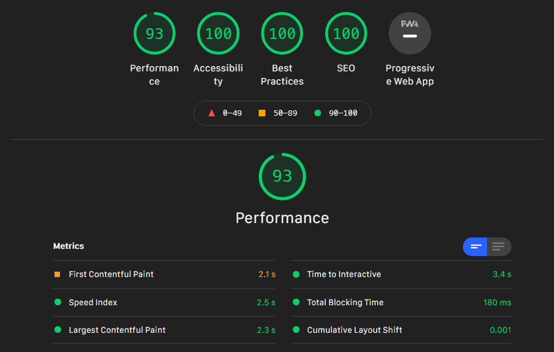

<h1>Splide</h1>

Splide is a lightweight, flexible and accessible slider and carousel. 
No dependencies, no Lighthouse errors.

  <a href="https://github.com/Splidejs/splide/releases/latest">Download</a>
   
  <a href="https://splidejs.com/guides/getting-started/">Getting Started</a>
   
  <a href="https://splidejs.com/">Demo</a>
   
  <a href="https://splidejs.com/documents/">Documents</a>
   
  <a href="https://splidejs.com/guides/themes/">Themes</a>
   
  <a href="https://splidejs.com/guides/version4/">About v4</a>
   
  <a href="https://github.com/Splidejs/splide/discussions">Discussions/Q&A</a>

<h3>
  Ready For
</h3>

  
  
  
  
  

<h3>
  Extensions
</h3>

  <a href="https://splidejs.com/extensions/auto-scroll/">Auto Scroll</a> ・
  <a href="https://splidejs.com/extensions/intersection/">Intersection</a> ・
  <a href="https://splidejs.com/extensions/grid/">Grid</a> ・
  <a href="https://splidejs.com/extensions/video/">Video</a> ・
  <a href="https://splidejs.com/extensions/url-hash/">URL Hash</a>

<h3>
  Translation
</h3>

  <a href="https://ja.splidejs.com">日本語</a>

## Support Splide

Please support the project if you like it! 
- [GitHub Sponsors](https://github.com/sponsors/NaotoshiFujita)

## Features

- Written in TypeScript
- No dependencies
- Lightweight, 29kB (12kB gzipped)
- Flexible and extensible
- Protected by 300+ test cases
- Multiple slides
- Slide or fade transition by CSS
- Supports breakpoints
- Accepts CSS relative units
- Autoplay with progress bar and a play-pause toggle button
- RTL and vertical direction
- Mouse drag and touch swipe
- Free drag mode
- Mouse wheel navigation
- Nested slider
- Lazy loading
- Thumbnail slider
- Auto width and height
- Accessibility friendly
- Live Region
- Internet Explorer 10

## No Lighthouse Errors

Here is the mobile version result of the [Splide front page](https://splidejs.com):

The Splide slider does not degrade Accessibility, Best Practices and SEO 🎉

## License

Splide is released under MIT license. © 2022 Naotoshi Fujita
