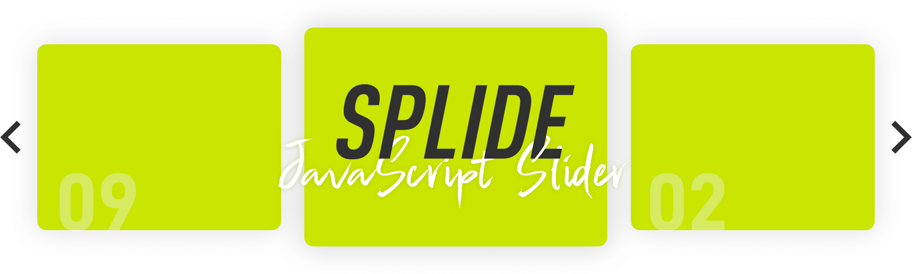

# Splide
<p align="center">
  <a href="https://splidejs.com/" target="_blank">
    
  </a>
</p>

**[Splide](https://splidejs.com/) is a lightweight, powerful and flexible slider and carousel, written in pure JavaScript without any dependencies.**

* [Demo](https://splidejs.com/)
* [Documents](https://splidejs.com/category/users-guide/)

## 🚨 Splide v3.0.0 Is Coming
Splide is planning to release the major version update soon (in a few days). I'm carefully building it with trying not to break sliders using old versions, but you should **lock the version** just in case.

I didn't expect so many people pick my library, but now it hits more than 240M per month in jsDelivr.
Thank you guys! 😄

### What's The Difference?
* Rewrite all scripts by TypeScript
* Reduce the code size (29KB -> around 26KB), keeping all features of the v2
* Add 300+ test cases to make the library more stable
* Implement the free drag mode
* Implement the simple mouse wheel navigation for a vertical slider
* Support sync with multiple sliders
* Support a placeholder image for lazy loading
* Support the `min-width` media query for breakpoints
* Handles passive event listeners where Lighthouse complains
* Solve the `window` reference error for SSR
* And more

If you are interested in the new version, check out the v3 branch 😎.

### Roadmap
1. ✔️Rewrite Splide
2. ✔️Rewrite Video Extension
3. ✔️Rewrite URL Hash Extension
4. ✔️Rewrite Grid Extension
5. ✔️Test and debug
6. Update the website and documents (I'm here)
7. Release
8. Rewrite React component
9. Rewrite Vue component
10. All done 🎉

### Caveats
* Methods of components will be drastically changed
* Some minor options will be removed
* All issues and PRs will be closed after the release

## v2 Features
* Pure JavaScript without any dependencies
* Small size, less than 29kB(11kB gzipped)
* Flexible and extensible
* Multiple slides
* Slide or fade transition by CSS
* Responsive, supporting breakpoints
* Accepting CSS relative units, such as vw, %, rem, etc
* No need to crop images
* Autoplay with progress bar and play/pause buttons
* "Right to left" and vertical direction
* Mouse drag and touch swipe
* Nested slider
* Lazy loading
* Thumbnail slider
* Accessibility friendly, supporting keyboard control and ARIA attributes
* Dynamically adding/removing slides
* Internet Explorer 10

## Installation
There are 3 ways to install the Splide on your site.
* NPM
* Download
* CDN

Only the NPM way is explained in the following steps. Visit [this page](https://splidejs.com/getting-started/) for other methods.

1. Get the latest version by NPM:
    ```bash
    $ npm install @splidejs/splide
    ```
1. Link to the stylesheet:
    ```html
    <link rel="stylesheet" href="node_modules/@splidejs/splide/dist/css/splide.min.css">
    ```
1. Write HTML for building a slider:
    ```html
    <div id="splide" class="splide">
      <div class="splide__track">
        <ul class="splide__list">
          <li class="splide__slide">Slide 01</li>
          <li class="splide__slide">Slide 02</li>
          <li class="splide__slide">Slide 03</li>
        </ul>
      </div>
    </div>
    ```
1. Initialize Splide. The selector accepts an ID, a class name or an Element itself:
    ```javascript
    import Splide from '@splidejs/splide';
    new Splide( '#splide' ).mount();
    ```
    Note that only the first element will be initialized even if using a class name.

See the [Integration](#integration) section for your Vue or React project.

## Options
### Changing Options
Pass an object to the second argument of the `Splide` constructor:
```javascript
new Splide( '#splide', {
  type   : 'loop',
  perPage: 3,
} );
```
Or set a `data-splide` attribute to a root element in a JSON format:
```html
<div id="splide" class="splide" data-splide='{"type":"loop","perPage":3}'>
</div>
```
### Available Options
Here is a list of options and brief explanations. Visit [this page](https://splidejs.com/options/) for more details.

* **type**: Determine a slider type.
* **rewind**: Whether to rewind a slider before the first slide or after the last one.
* **speed**: Transition speed in milliseconds.
* **rewindSpeed**: Transition speed on rewind in milliseconds.
* **waitForTransition**: Whether to prevent any actions while a slider is transitioning.
* **width**: Define slider max width.
* **height**: Define slider height.
* **fixedWidth**: Fix width of slides.
* **fixedHeight**: Fix height of slides.
* **heightRatio**: Determine height of slides by ratio to a slider width.
* **autoWidth**: If true, slide width will be determined by the element width itself. This is for a horizontal slider.
* **autoHeight**: If true, slide height will be determined by the element height itself. This is for a vertical slider.
* **perPage**: Determine how many slides should be displayed per page.
* **perMove**: Determine how many slides should be moved when a slider goes to next or previous page.
* **clones**: Manually determine how many clones should be generated on one side.
* **start**: Start index.
* **focus**: Determine which slide should be focused.
* **gap**: Gap between slides.
* **padding**: Set padding-left/right in horizontal mode or padding-top/bottom in vertical one.
* **easing**: Animation timing function for CSS transition.
* **arrows**: Whether to append arrows.
* **arrowPath**: Change the arrow SVG path.
* **pagination**: Whether to append pagination(indicator dots).
* **autoplay**: Whether to enable autoplay.
* **interval**: Autoplay interval in milliseconds.
* **pauseOnHover**: Whether to stop autoplay while a slider is hovered.
* **pauseOnFocus**: Whether to stop autoplay while a slider elements are focused.
* **resetProgress**: Whether to reset progress of the autoplay timer when resumed.
* **lazyLoad**: Enable lazy load for images.
* **preloadPages**: Determine how many pages around an active slide should be loaded beforehand. This only works the lazyLoad option is “nearby”.
* **keyboard**: Whether to control a slider via keyboard.
* **drag**: Whether to allow mouse drag and touch swipe.
* **dragAngleThreshold**: The angle threshold for drag.
* **swipeDistanceThreshold**: Distance threshold for determining if the action is "flick" or "swipe".
* **flickVelocityThreshold**: Velocity threshold for determining if the action is "flick" or "swipe".
* **flickPower**: Determine power of flick. The larger number this is, the farther a slider runs by flick.
* **flickMaxPages**: Limit a number of pages to move by flick.
* **direction**: Slider direction.
* **cover**: Whether to convert an img src to background-image of its parent element. height, fixedHeight or heightRatio is required.
* **accessibility**: Whether to enable accessibility(ARIA attributes) or not.
* **slideFocus**: Whether to add tabindex="0" to visible slides or not.
* **isNavigation**: Determine if a slider is navigation for another.
* **trimSpace**: Whether to trim spaces before the fist slide or after the last one.
* **updateOnMove**: If true, "is-active" class added to the slide element before transition.
* **throttle**: Throttle duration for the resize event.
* **breakpoints**: Breakpoints definitions.
* **classes**: Collection of class names.
* **i18n**: Collection of texts for i18n.

## Extensions
* [Video](https://splidejs.com/extension-video/): Assign HTML video, YouTube or Vimeo to slides.
* [URL Hash Navigation](https://splidejs.com/extension-url-hash-navigation/): Listen to hash change and move a slider to a slide having the hash data attribute.
* [Grid](https://splidejs.com/extension-grid/): Create rows and cols in a slider.

## Integration
<p>
    <a href="https://vuejs.org/" target="_blank">
        
    </a>
    <a href="https://reactjs.org/" target="_blank">
        
    </a>
</p>

Easy to integrate the Splide slider or carousel into your Vue or React project.

* [Vue Splide](https://splidejs.com/integration-vue-splide/)
* [React Splide](https://splidejs.com/integration-react-splide/)

## API and Extension
Splide provides some APIs and the way to customize the behaviour programmatically.
* [APIs](https://splidejs.com/apis/)
* [Extension](https://splidejs.com/extension/)

## License
Splide is released under the MIT license.
© 2020 Naotoshi Fujita
